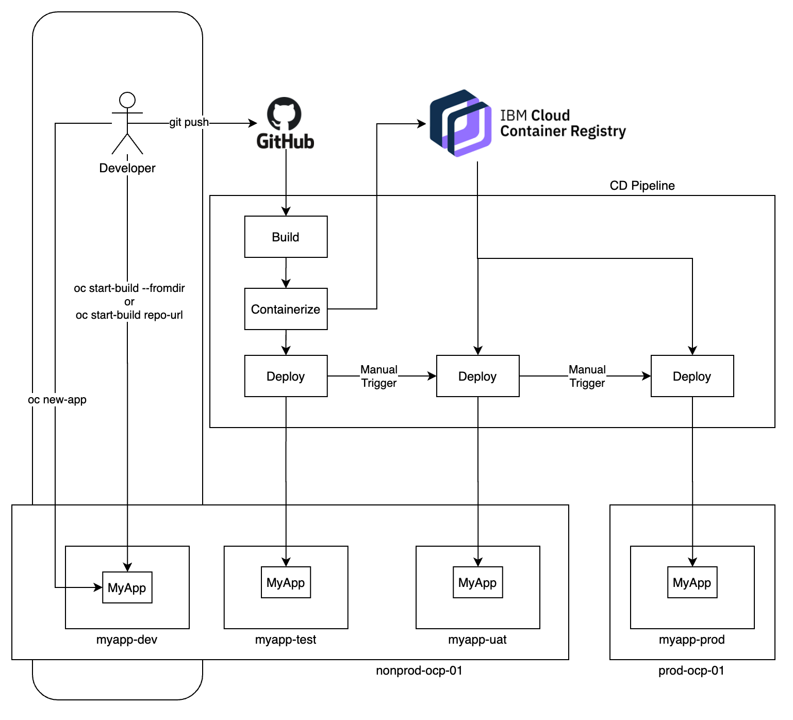

# Deployment Options

## Code Engine

Here is how to build and deploy your app in IBM Code Engine.

## OpenShift

Here is how you can build and deploy your app to OpenShift....

In general, the pipeline looks like this:

