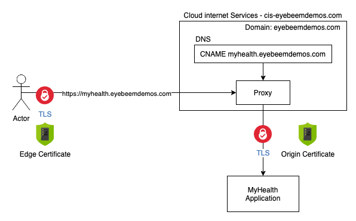

# TLS

There are several ways to set up TLS for your application.  If your domain is being managed by IBM Cloud Internet Services (CIS), it can leverage advanced features such as DDoS protection, Web Application Firewall, certificate management, DNS and others.

In this case, the application is using a domain (eyebeemdemos.com) that is managed by CIS.  The DNS definitions in the CIS instance include a `CNAME` record for `myhealth.eyebeemdemos.com` that points to the ingress subdomain of the OpenShift cluster running the application.  This record also has the ability enable the proxy features of CIS, and the TLS settings for this domain are for it to enforce TLS using signed certificates from end-to-end.

When the proxy feature is used, CIS will terminate the incoming TLS connection from the browser using an edge certificate signed by CIS.  It initiates a new TLS connection from CIS to the "origin" server (in this case the OpenShift cluster).  This means that somewhere in OpenShift there needs to be a definition somewhere to terminate that TLS connection.  TLS could be terminated with an OpenShift route, a Kubernetes Ingress, or a Virtual Service in Istio.  It could also be terminated inside the application container using Nginx, custom code in the app, or other methods depending on the technology being used to run the application.

## IBM Certificate Manager

.....describe Certificate Manager........

It is also possible to leverage IBM Certificate Manager to order and manage TLS certificates.  In this case it might not be possible to use the proxy function of IBM Cloud Internet Services.  However, the TLS termination techniques are the same.  

Part of the value of using Certificate Manager is that it will manage the certificate lifecycle and send notifications of lifecycle events.  One of the biggest challenges with certificates is making sure to renew them and to update them where they are being used before they expire.  Certificate Manager can be configured to automatically renew certificates before they expire, and it will send notifications before the certificate expires and when it gets renewed.

The notifications can take the form of a webhook, which means you can implement an application that gets notified of these lifecycle events and respond appropriately to them when they occur.  For example, when a certicate gets renewed, the webhook will fire, and the code could download the new certificate material and automatically update it where it is used.  Let's take a look at an example of this in action.

The IBM Cloud CLI and API for Kubernetes include methods for integrating Certificate Manager with your cluster.  Let's examine this command:

`ibmcloud oc ingress secret create <secret-name> --cluster <cluster-name> --cert-crn <the CRN of the certificate> --namespace <secret namespace>`

When this command is executed, it will download the certificate material from Certificate Manager and use it to create a secret in your cluster.  The Ingress object references this secret in order to terminate the TLS connection.  When the certicate gets renewed the command `ibmcloud oc ingress secret update ...` will update the secret with the new certificate.  If you build a webhook to execute the API equivalent of this CLI command it will fire when the certificate gets renewed and automatically replace the certificate with the new one, allowing your application to always be secured.

!!! tip
    IBM Certificate Manager also supports the ability to import certificates.  If you choose to use some other source to create and renew certificates (say origin certificates in Cloud Internet Services) you can still import/update them in Certificate Manager.  This will cause the same webhooks to fire your automation to deploy them as appropriate, such as a kubernetes secret in your cluster.

The webhook implementation can be hosted in a number of ways; in this case it was built using [IBM Cloud Functions](https://cloud.ibm.com/functions/), which is based on the open source [Openwhisk](https://openwhisk.apache.org/) project.  There is a new service called [IBM Code Engine](https://cloud.ibm.com/codeengine/overview) that is currently in beta that also provides "serverless" or "scale to zero" capabilities.  IBM Code Engine is build on the open source [Knative](https://knative.dev/) project.